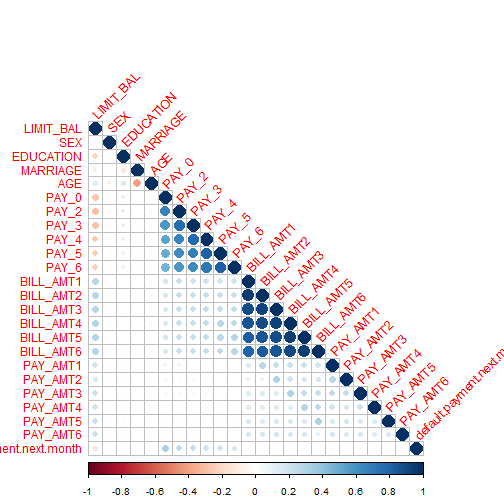
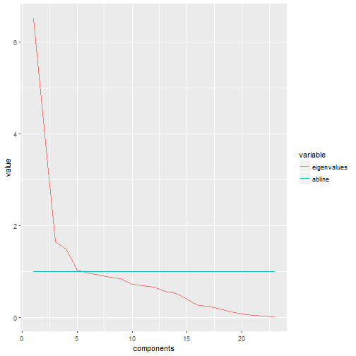
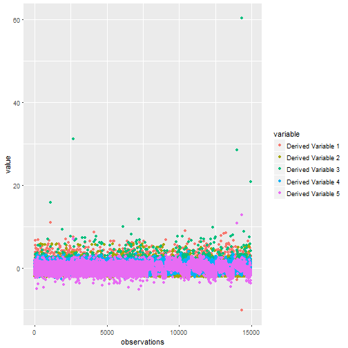

## Project Objective

Credit card default can have serious consequences. For individuals defaulting it can make it harder to take out loans and affect your credit rating or even result in legal action. For banks, credit card default presents a real source of risk. 

We have chosen to explore a dataset describing Taiwanese credit card default rates. The data set contains information for 30,000 individuals over a period of 6 months in 2005 (April-September). We look at both demographic and financial variables to see what factors are most predictive of default.In this analysis we use dimensionality reduction and factor analysis methods to produce a model that predicts default probability.

## There are 24 variables:

Variable Name | Description
----------------|---------------------------------------------------
**LIMIT:** | Amount of given credit in NT dollars (includes individual and family/supplementary credit
**SEX:** | Gender (1=male, 2=female)
**EDUCATION:** | (1=graduate school, 2=university, 3=high school, 4=others, 5=unknown, 6=unknown)
**MARRIAGE:** | Marital status (1=married, 2=single, 3=others)
**AGE:** | Age in years
**PAY 0:** | Repayment status in September, 2005 (-1=pay duly, 1=payment delay for one month, 2=payment delay for two months, ... 8=payment delay for eight months, 9=payment delay for nine months and above)
**PAY 2:**| Repayment status in August, 2005 (scale same as above)
**PAY 3:** |Repayment status in July, 2005 (scale same as above)
**PAY 4:** |Repayment status in June, 2005 (scale same as above)
**PAY 5:** |Repayment status in May, 2005 (scale same as above)
**PAY 6:** |Repayment status in April, 2005 (scale same as above)
**BILL AMT1:** |Amount of bill statement in September, 2005 (NT dollar)
**BILL AMT2:** |Amount of bill statement in August, 2005 (NT dollar)
**BILL AMT3:** |Amount of bill statement in July, 2005 (NT dollar)
**BILL AMT4:** |Amount of bill statement in June, 2005 (NT dollar)
**BILL AMT5:** |Amount of bill statement in May, 2005 (NT dollar)
**BILL AMT6:** |Amount of bill statement in April, 2005 (NT dollar)
**PAY AMT1:** |Amount of previous payment in September, 2005 (NT dollar)
**PAY AMT2:** |Amount of previous payment in August, 2005 (NT dollar)
**PAY AMT3:** |Amount of previous payment in July, 2005 (NT dollar)
**PAY AMT4:** |Amount of previous payment in June, 2005 (NT dollar)
**PAY AMT5:** |Amount of previous payment in May, 2005 (NT dollar)
**PAY AMT6:** |Amount of previous payment in April, 2005 (NT dollar)
**DEFAULT STATUS:** |Default payment (1=yes, 0=no)

## Process

1) To begin our analysis we have collected the data, confirmed that the variables are metric and sensible. To test the accuracy of our prediction model, we randomly separated our dataset into two subsets of 15,000 individuals. The first set is used for learning and creating a model while the second is used to test that model.

2) We looked at correlations of the entire dataset and visualized the correlations

3) Using the training dataset we conducted a factor analysis and visualized the results in a scree plot

4) We then used dimensionality reduction to synthesize the data into 5 components. We created a new dataset using these 5 components.

5) We performed a regression to find an equation that estimates credit card default probability as a factor of these 5 components.

6) We applied the same transformation and regression formula to our testing dataset to validate the credit card default probability of the first set.


## Visualizing correlation in the raw data

Reviewing correlation in the data


```r
library(ggplot2)
library(Hmisc)
```

```
## Loading required package: lattice
```

```
## Loading required package: survival
```

```
## Loading required package: Formula
```

```
## 
## Attaching package: 'Hmisc'
```

```
## The following objects are masked from 'package:base':
## 
##     format.pval, round.POSIXt, trunc.POSIXt, units
```

```r
library(corrplot)

mcor <- cor(creditdefault)
corrplot(mcor, type="lower", tl.srt=45)
```




Building a model from a 'training' dataset

Defining the 'training' and 'testing' datasets 


```r
creditdefault$intrain <- sample(2, size=nrow(creditdefault), replace= TRUE)-1 # adds a variable "intrain" to include in training set 
train <- creditdefault[which(creditdefault$intrain==1),] # creates a randomly selected training dataset
train <- train [,-25] # removes the final column "intrain"
originaltrain <- train
test <- creditdefault[which(creditdefault$intrain==0),] # creates a randomly selected test dataset
test <- test [,-25] # removes the final column "intrain"
```


## Factor Analysis and Dimensionality Reduction 

Next we use factor analysis to synthesize the 24 variables into several components that describe the dataset. We used eigenvalue as a selection criteria for this analysis.


```r
MIN_VALUE=0.5
max_data_report= 10

# Original raw attributes used. 
factor_attributes_used= c(1:23)

# Please ENTER the selection criterions for the factors to use. 
# Choices: "eigenvalue", "variance", "manual"
factor_selectionciterion = "eigenvalue"

# Please ENTER the desired minumum variance explained 
# (ONLY USED in case "variance" is the factor selection criterion used). 
minimum_variance_explained = 65  # between 1 and 100

# Please ENTER the number of factors to use 
# (ONLY USED in case "manual" is the factor selection criterion used).
manual_numb_factors_used = 2

# Please ENTER the rotation eventually used (e.g. "none", "varimax", "quatimax", "promax", "oblimin", "simplimax", and "cluster" - see help(principal)). Defauls is "varimax"
rotation_used="varimax"

factor_attributes_used = unique(sapply(factor_attributes_used,function(i) min(ncol(train), max(i,1))))
TrainFactor=train[,factor_attributes_used]
TrainFactor <- train <- data.matrix(TrainFactor)

source("C:/Users/Shira/Documents/R/Group-Project/AnalyticsLibraries/library.R")
```

```
## Creating a generic function for 'toJSON' from package 'jsonlite' in package 'googleVis'
```

```r
source("C:/Users/Shira/Documents/R/Group-Project/AnalyticsLibraries/heatmapOutput.R")

UnRotated_Results<-principal(train, nfactors=ncol(train), rotate="none",score=TRUE)
UnRotated_Factors<-round(UnRotated_Results$loadings,2)
UnRotated_Factors<-as.data.frame(unclass(UnRotated_Factors))
colnames(UnRotated_Factors)<-paste("Component",1:ncol(UnRotated_Factors),sep=" ")

#Creates a table of factors that includes their eigenvalues, percent of explained variance and cumulative percent of explained variance
Variance_Explained_Table_results<-PCA(train, graph=FALSE)
Variance_Explained_Table<-Variance_Explained_Table_results$eig
Variance_Explained_Table_copy<-Variance_Explained_Table


rownames(Variance_Explained_Table) <- paste("Component", 1:nrow(Variance_Explained_Table))
colnames(Variance_Explained_Table) <- c("Eigenvalue", "Pct of explained variance", "Cumulative pct of explained variance")

knitr::kable(round(Variance_Explained_Table, 2))
```


|             | Eigenvalue| Pct of explained variance| Cumulative pct of explained variance|
|:------------|----------:|-------------------------:|------------------------------------:|
|Component 1  |       6.51|                     28.32|                                28.32|
|Component 2  |       4.12|                     17.93|                                46.25|
|Component 3  |       1.65|                      7.17|                                53.42|
|Component 4  |       1.49|                      6.49|                                59.91|
|Component 5  |       1.03|                      4.48|                                64.39|
|Component 6  |       0.97|                      4.23|                                68.62|
|Component 7  |       0.92|                      4.01|                                72.62|
|Component 8  |       0.88|                      3.82|                                76.44|
|Component 9  |       0.85|                      3.72|                                80.15|
|Component 10 |       0.73|                      3.16|                                83.32|
|Component 11 |       0.69|                      2.99|                                86.31|
|Component 12 |       0.66|                      2.88|                                89.19|
|Component 13 |       0.57|                      2.47|                                91.66|
|Component 14 |       0.53|                      2.29|                                93.95|
|Component 15 |       0.40|                      1.76|                                95.71|
|Component 16 |       0.26|                      1.12|                                96.82|
|Component 17 |       0.25|                      1.10|                                97.93|
|Component 18 |       0.18|                      0.80|                                98.73|
|Component 19 |       0.13|                      0.56|                                99.29|
|Component 20 |       0.07|                      0.32|                                99.60|
|Component 21 |       0.04|                      0.18|                                99.78|
|Component 22 |       0.03|                      0.11|                                99.90|
|Component 23 |       0.02|                      0.10|                               100.00|

One can also plot the eigenvalues of the generated factors in decreasing order: this plot is called the **scree plot**. For our data this plot looks as follows:


```r
eigenvalues  <- Variance_Explained_Table[, "Eigenvalue"]
NEW_train           <- cbind(as.data.frame(eigenvalues), c(1:length(eigenvalues)), rep(1, length(eigenvalues)))
colnames(NEW_train) <- c("eigenvalues", "components", "abline")
ggplot(melt(NEW_train, id="components"), aes(x=components, y=value, colour=variable)) + geom_line()
```



As you can see from the scree plot, the "elbow" is at 5 components, which represents 64.4% of cumulative explained variance. We opted to stick with 5 components for our analysis, given that the eigenvalue method produced the same number of components.


```r
if (factor_selectionciterion == "eigenvalue")
  factors_selected = sum(Variance_Explained_Table_copy[,1] >= 1)
if (factor_selectionciterion == "variance")
  factors_selected = 1:head(which(Variance_Explained_Table_copy[,"cumulative percentage of variance"]>= minimum_variance_explained),1)
if (factor_selectionciterion == "manual")
  factors_selected = manual_numb_factors_used
```


## Interpreting the components

We used a rotation to look at how each of the financial and demographic variables flowed into the 5 components. 


```r
Rotated_Results<-principal(train, nfactors=max(factors_selected), rotate=rotation_used,score=TRUE)
Rotated_Factors<-round(Rotated_Results$loadings,2)
Rotated_Factors<-as.data.frame(unclass(Rotated_Factors))
colnames(Rotated_Factors)<-paste("Component",1:ncol(Rotated_Factors),sep=" ")

sorted_rows <- sort(Rotated_Factors[,1], decreasing = TRUE, index.return = TRUE)$ix
Rotated_Factors <- Rotated_Factors[sorted_rows,]

knitr::kable(Rotated_Factors)
```


|          | Component 1| Component 2| Component 3| Component 4| Component 5|
|:---------|-----------:|-----------:|-----------:|-----------:|-----------:|
|BILL_AMT2 |        0.94|        0.13|        0.11|        0.02|       -0.01|
|BILL_AMT1 |        0.93|        0.11|        0.06|        0.03|       -0.03|
|BILL_AMT4 |        0.93|        0.16|        0.19|        0.01|        0.01|
|BILL_AMT3 |        0.92|        0.14|        0.19|        0.02|        0.02|
|BILL_AMT5 |        0.91|        0.16|        0.22|        0.01|        0.00|
|BILL_AMT6 |        0.89|        0.16|        0.22|        0.01|       -0.02|
|LIMIT_BAL |        0.36|       -0.44|        0.31|        0.08|       -0.24|
|PAY_AMT5  |        0.15|       -0.06|        0.40|        0.00|       -0.17|
|PAY_2     |        0.14|        0.83|       -0.09|        0.01|       -0.03|
|PAY_6     |        0.14|        0.82|        0.04|       -0.03|        0.01|
|PAY_5     |        0.13|        0.87|        0.02|       -0.02|        0.00|
|PAY_0     |        0.12|        0.71|       -0.13|        0.02|       -0.01|
|PAY_3     |        0.12|        0.87|       -0.04|       -0.01|       -0.01|
|PAY_4     |        0.12|        0.88|       -0.01|       -0.01|       -0.01|
|PAY_AMT3  |        0.12|       -0.03|        0.65|        0.00|        0.02|
|PAY_AMT6  |        0.12|       -0.06|        0.41|        0.00|       -0.19|
|PAY_AMT1  |        0.10|        0.00|        0.66|        0.00|        0.10|
|PAY_AMT4  |        0.09|       -0.04|        0.58|        0.00|       -0.03|
|PAY_AMT2  |        0.05|       -0.01|        0.68|        0.00|        0.13|
|AGE       |        0.04|       -0.07|        0.04|        0.81|       -0.18|
|SEX       |        0.02|       -0.11|        0.01|       -0.08|        0.83|
|EDUCATION |       -0.01|        0.18|       -0.08|        0.48|        0.41|
|MARRIAGE  |       -0.03|        0.05|        0.00|       -0.79|       -0.02|

Suppressing small numbers (<0.5) to better visualize and interpret the factors we see the following:


|          | Component 1| Component 2| Component 3| Component 4| Component 5|
|:---------|-----------:|-----------:|-----------:|-----------:|-----------:|
|BILL_AMT2 |        0.94|          NA|          NA|          NA|          NA|
|BILL_AMT1 |        0.93|          NA|          NA|          NA|          NA|
|BILL_AMT4 |        0.93|          NA|          NA|          NA|          NA|
|BILL_AMT3 |        0.92|          NA|          NA|          NA|          NA|
|BILL_AMT5 |        0.91|          NA|          NA|          NA|          NA|
|BILL_AMT6 |        0.89|          NA|          NA|          NA|          NA|
|LIMIT_BAL |          NA|          NA|          NA|          NA|          NA|
|PAY_AMT5  |          NA|          NA|          NA|          NA|          NA|
|PAY_2     |          NA|        0.83|          NA|          NA|          NA|
|PAY_6     |          NA|        0.82|          NA|          NA|          NA|
|PAY_5     |          NA|        0.87|          NA|          NA|          NA|
|PAY_0     |          NA|        0.71|          NA|          NA|          NA|
|PAY_3     |          NA|        0.87|          NA|          NA|          NA|
|PAY_4     |          NA|        0.88|          NA|          NA|          NA|
|PAY_AMT3  |          NA|          NA|        0.65|          NA|          NA|
|PAY_AMT6  |          NA|          NA|          NA|          NA|          NA|
|PAY_AMT1  |          NA|          NA|        0.66|          NA|          NA|
|PAY_AMT4  |          NA|          NA|        0.58|          NA|          NA|
|PAY_AMT2  |          NA|          NA|        0.68|          NA|          NA|
|AGE       |          NA|          NA|          NA|        0.81|          NA|
|SEX       |          NA|          NA|          NA|          NA|        0.83|
|EDUCATION |          NA|          NA|          NA|          NA|          NA|
|MARRIAGE  |          NA|          NA|          NA|       -0.79|          NA|
As described in this chart the components can be described as below:

Component 1 - Predominantly characterized by bill amounts
Component 2 - Predominantly characterized by payments
Component 3 - Predominantly characterized by payment amounts
Component 4 - Predominantly characterized by age, marriage and education
Component 5 - Predominantly characterized by gender

Using these 5 rotated factors, we can create a new dataset where our observations are as follows (for the first 10 observations):


```r
NEW_train <- round(Rotated_Results$scores[,1:factors_selected,drop=F],2)
colnames(NEW_train)<-paste("Derived Variable (Factor)",1:ncol(NEW_train),sep=" ")

knitr::kable(NEW_train[1:min(max_data_report,nrow(NEW_train)), , drop=F])
```


|   | Derived Variable (Factor) 1| Derived Variable (Factor) 2| Derived Variable (Factor) 3| Derived Variable (Factor) 4| Derived Variable (Factor) 5|
|:--|---------------------------:|---------------------------:|---------------------------:|---------------------------:|---------------------------:|
|15 |                        0.32|                        0.09|                       -0.19|                       -1.09|                       -1.43|
|16 |                       -0.18|                        0.75|                       -0.47|                       -1.71|                        1.44|
|17 |                       -0.73|                        1.74|                       -0.03|                       -1.41|                       -1.16|
|19 |                       -0.34|                       -1.56|                       -0.43|                        1.02|                       -0.19|
|21 |                       -0.41|                        0.11|                        0.06|                        0.20|                        0.86|
|22 |                       -0.57|                       -0.74|                       -0.38|                        0.76|                        0.82|
|23 |                       -0.17|                        1.55|                       -0.11|                       -0.98|                        0.93|
|24 |                       -0.27|                       -2.02|                        0.09|                        0.47|                        0.03|
|26 |                       -0.20|                        0.39|                       -0.42|                       -0.65|                       -0.03|
|27 |                       -0.63|                       -0.52|                       -0.48|                       -1.22|                       -1.07|


```r
df <- as.data.frame(NEW_train)
colnames(df) <- paste("Derived Variable", 1:ncol(df))
df <- cbind(
  list(observations = 1:nrow(df)),
  df
)

ggplot(melt(df, id="observations"), aes(x=observations, y=value, colour=variable)) + geom_point()
```



## Regression

At this point, we perform a linear regression to this dataset to create a relationship between the credit card default probability and the 5 components we derived above.


```r
dff <- cbind(df,originaltrain[,24])

model_logit = step(glm( dff$`originaltrain[, 24]` ~ 1, family="binomial"), direction="forward", scope ~ scale(dff$`Derived Variable 1`) + scale(dff$`Derived Variable 2`) + scale(dff$`Derived Variable 3`)+scale(dff$`Derived Variable 4`)+scale(dff$`Derived Variable 5`))
```

```
## Start:  AIC=15848.7
## dff$`originaltrain[, 24]` ~ 1
```

```
## Warning: glm.fit: fitted probabilities numerically 0 or 1 occurred
```

```
##                                   Df Deviance   AIC
## + scale(dff$`Derived Variable 2`)  1    14693 14697
## + scale(dff$`Derived Variable 3`)  1    15636 15640
## + scale(dff$`Derived Variable 1`)  1    15810 15814
## + scale(dff$`Derived Variable 4`)  1    15831 15835
## + scale(dff$`Derived Variable 5`)  1    15832 15836
## <none>                                  15847 15849
## 
## Step:  AIC=14697.02
## dff$`originaltrain[, 24]` ~ scale(dff$`Derived Variable 2`)
```

```
## Warning: glm.fit: fitted probabilities numerically 0 or 1 occurred
```

```
##                                   Df Deviance   AIC
## + scale(dff$`Derived Variable 3`)  1    14487 14493
## + scale(dff$`Derived Variable 1`)  1    14672 14678
## + scale(dff$`Derived Variable 4`)  1    14679 14685
## + scale(dff$`Derived Variable 5`)  1    14681 14687
## <none>                                  14693 14697
```

```
## Warning: glm.fit: fitted probabilities numerically 0 or 1 occurred
```

```
## 
## Step:  AIC=14493.25
## dff$`originaltrain[, 24]` ~ scale(dff$`Derived Variable 2`) + 
##     scale(dff$`Derived Variable 3`)
```

```
## Warning: glm.fit: fitted probabilities numerically 0 or 1 occurred

## Warning: glm.fit: fitted probabilities numerically 0 or 1 occurred

## Warning: glm.fit: fitted probabilities numerically 0 or 1 occurred

## Warning: glm.fit: fitted probabilities numerically 0 or 1 occurred
```

```
##                                   Df Deviance   AIC
## + scale(dff$`Derived Variable 5`)  1    14464 14472
## + scale(dff$`Derived Variable 1`)  1    14469 14477
## + scale(dff$`Derived Variable 4`)  1    14474 14482
## <none>                                  14487 14493
```

```
## Warning: glm.fit: fitted probabilities numerically 0 or 1 occurred
```

```
## 
## Step:  AIC=14472.11
## dff$`originaltrain[, 24]` ~ scale(dff$`Derived Variable 2`) + 
##     scale(dff$`Derived Variable 3`) + scale(dff$`Derived Variable 5`)
```

```
## Warning: glm.fit: fitted probabilities numerically 0 or 1 occurred

## Warning: glm.fit: fitted probabilities numerically 0 or 1 occurred

## Warning: glm.fit: fitted probabilities numerically 0 or 1 occurred
```

```
##                                   Df Deviance   AIC
## + scale(dff$`Derived Variable 1`)  1    14446 14456
## + scale(dff$`Derived Variable 4`)  1    14451 14461
## <none>                                  14464 14472
```

```
## Warning: glm.fit: fitted probabilities numerically 0 or 1 occurred
```

```
## 
## Step:  AIC=14456.22
## dff$`originaltrain[, 24]` ~ scale(dff$`Derived Variable 2`) + 
##     scale(dff$`Derived Variable 3`) + scale(dff$`Derived Variable 5`) + 
##     scale(dff$`Derived Variable 1`)
```

```
## Warning: glm.fit: fitted probabilities numerically 0 or 1 occurred

## Warning: glm.fit: fitted probabilities numerically 0 or 1 occurred
```

```
##                                   Df Deviance   AIC
## + scale(dff$`Derived Variable 4`)  1    14433 14445
## <none>                                  14446 14456
```

```
## Warning: glm.fit: fitted probabilities numerically 0 or 1 occurred
```

```
## 
## Step:  AIC=14445
## dff$`originaltrain[, 24]` ~ scale(dff$`Derived Variable 2`) + 
##     scale(dff$`Derived Variable 3`) + scale(dff$`Derived Variable 5`) + 
##     scale(dff$`Derived Variable 1`) + scale(dff$`Derived Variable 4`)
```

```r
summary(model_logit)
```

```
## 
## Call:
## glm(formula = dff$`originaltrain[, 24]` ~ scale(dff$`Derived Variable 2`) + 
##     scale(dff$`Derived Variable 3`) + scale(dff$`Derived Variable 5`) + 
##     scale(dff$`Derived Variable 1`) + scale(dff$`Derived Variable 4`), 
##     family = "binomial")
## 
## Deviance Residuals: 
##     Min       1Q   Median       3Q      Max  
## -2.3700  -0.7253  -0.5749  -0.3140   3.6814  
## 
## Coefficients:
##                                 Estimate Std. Error z value Pr(>|z|)    
## (Intercept)                     -1.42394    0.02302 -61.850  < 2e-16 ***
## scale(dff$`Derived Variable 2`)  0.67512    0.02170  31.109  < 2e-16 ***
## scale(dff$`Derived Variable 3`) -0.62015    0.05261 -11.787  < 2e-16 ***
## scale(dff$`Derived Variable 5`) -0.10298    0.02154  -4.782 1.74e-06 ***
## scale(dff$`Derived Variable 1`) -0.09493    0.02306  -4.116 3.86e-05 ***
## scale(dff$`Derived Variable 4`)  0.07439    0.02043   3.641 0.000272 ***
## ---
## Signif. codes:  0 '***' 0.001 '**' 0.01 '*' 0.05 '.' 0.1 ' ' 1
## 
## (Dispersion parameter for binomial family taken to be 1)
## 
##     Null deviance: 15847  on 14972  degrees of freedom
## Residual deviance: 14433  on 14967  degrees of freedom
## AIC: 14445
## 
## Number of Fisher Scoring iterations: 5
```

## Using the test set to check the training set

We then use the testing dataset, defined at the beginning of the analysis to verify the accuracy of the regression that we developed using the training dataset.

We counted the number of correct predictions and divided by the total number of predictions to estimate the accuracy of the model.


```r
TestRotated_Results<-principal(test, nfactors=max(factors_selected), rotate=rotation_used,score=TRUE)
TestRotated_Factors<-round(TestRotated_Results$loadings,2)
TestRotated_Factors<-as.data.frame(unclass(TestRotated_Factors))
colnames(TestRotated_Factors)<-paste("Component",1:ncol(TestRotated_Factors),sep=" ")

sorted_rows <- sort(TestRotated_Factors[,1], decreasing = TRUE, index.return = TRUE)$ix
TestRotated_Factors <- TestRotated_Factors[sorted_rows,]

NEW_test <- round(TestRotated_Results$scores[,1:factors_selected,drop=F],2)
colnames(NEW_test)<-paste("Derived Variable (Factor)",1:ncol(NEW_test),sep=" ")

#colnames(NEW_test) <- paste("Derived Variable", 1:ncol(NEW_test))
#NEW_test <- cbind(list(observations = 1:nrow(NEW_test)),NEW_test)

modelcoefficients <- coef(model_logit)

predicteddefault <- modelcoefficients[4]*NEW_test[,1]+modelcoefficients[2]*NEW_test[,2]+modelcoefficients[3]*NEW_test[,3]+modelcoefficients[5]*NEW_test[,4]+modelcoefficients[6]*NEW_test[,5]+modelcoefficients[1]

rightcounter = 0;

for (i in 1:length(predicteddefault))
{  
  if (predicteddefault[i] < -1) {predicteddefault[i]=0} else {predicteddefault[i]=1}
  if (predicteddefault[i] - test$default.payment.next.month[i] == 0) {rightcounter=rightcounter+1}
}

accuracy = 100*rightcounter/length(predicteddefault)
```


## Conclusion

```r
accuracy
```

```
## [1] 73.56758
```

To conclude, after several iterations, we found that our model accurately predicted credit card default approximately 75% of the time.

This model could be possibly extended by trying different regression models using different, additional derived variables or even on the entirety of the original data. Cluster analysis could also be used to segment the population and assign a probability of default to each. A regression performed on the groups defined by the cluster analysis may provide a more accurate model.
